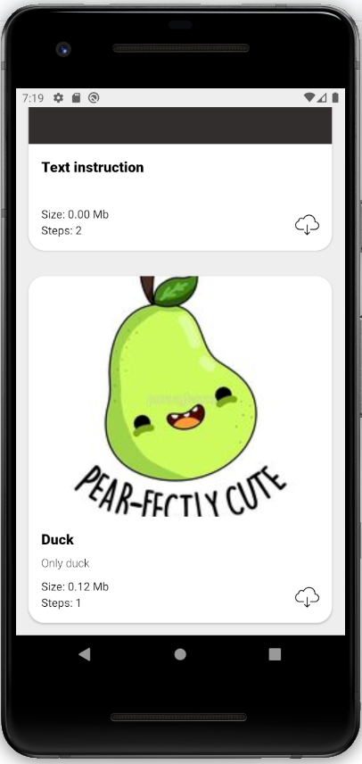
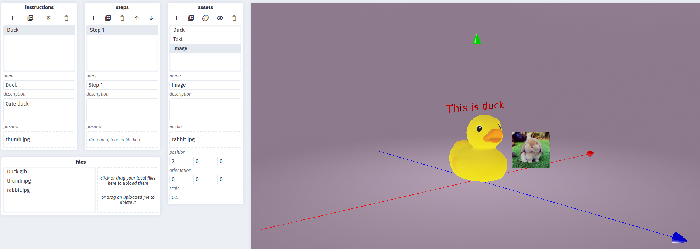

# Innopolis Spring 2020 Software Project

## Virtual assistant

Purpose - providing interactive instructions on a complex technological
process and for working with high-tech and expensive equipment. Instructions
are provided in the form of text, images, and animated holograms.

## Structure

- Web editor
- Server
- AR/MR devices

## Technology stack

- Android Studio (3.53! Very important to have this version)
- ARCore
- Sceneform
- WebGL
- GLTF
- gRPC
- Vue.JS
- Babylon.JS

## Hardware

In order to run applications you should have Android SDK V27, at least.
Check if your device is supported [here](https://developers.google.com/ar/discover/supported-devices).

If you don't have it, you can setup the Android Virtual Device. To do that, please, follow [this](https://developers.google.com/ar/develop/java/quickstart) guide.

## Software

Here is the Virtual Assistant app, Web Editor page, and Python Server to serve them.

### How to run

- [Download](https://github.com/Sarrasor/INNO-S20-SP/releases) Virtual Assistant app apk 
- Go to the [Web Editor](https://sarrasor.github.io/INNO-S20-SP/)
- Enjoy

### Contents

Here is a brief desciption of folders.

### python-server

Contains python server with instructions API.
There is README.md inside with more detailed explanation.

### virtual-assistant

Contains Virtual Assistant app. You can download the latest version [here](https://github.com/Sarrasor/INNO-S20-SP/releases).

[Video](https://drive.google.com/file/d/1CL9LkvtQERKDECgmdhwFlaOlP5pUo9sP/view)

### web-editor

Contains Web Editor code. Instructions are included in the folder

[Link to Web Editor](https://sarrasor.github.io/INNO-S20-SP/)

### images

Images used

### models

Models used
