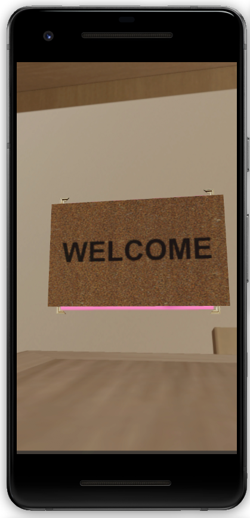
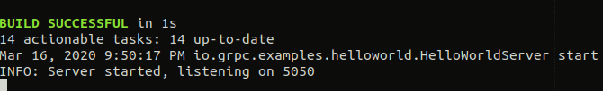
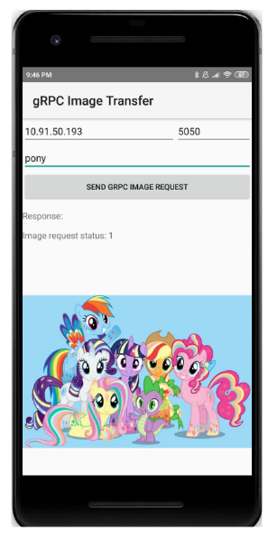
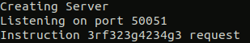
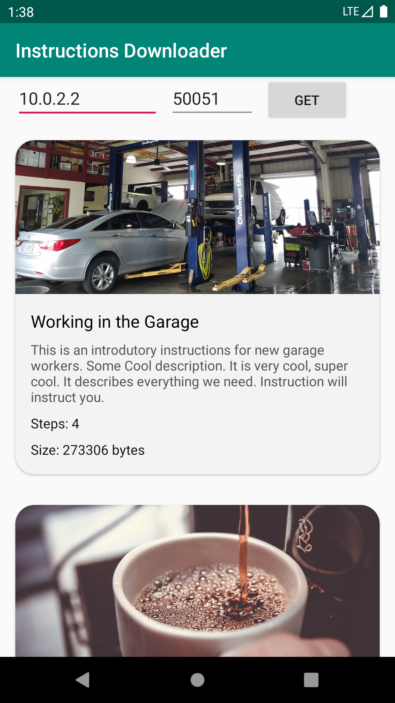

# Innopolis Spring 2020 Software Project

## Virtual assistant
Purpose - providing interactive instructions on a complex technological
process and for working with high-tech and expensive equipment. Instructions
are provided in the form of text, images, and animated holograms.

## Structure
- Web
- AR/MR devices
- Server

## Technology stack
- Android Studio (3.53! Very important to have this version)
- ARCore
- Sceneform
- WebGL
- GLTF
- gRPC

## Hardware
In order to run applications you should have Android SDK V29, at least. 
Check if your device is supported [here](https://developers.google.com/ar/discover/supported-devices).

If you don't have it, you can setup the Android Virtual Device. To do that, please, follow [this](https://developers.google.com/ar/develop/java/quickstart) guide.

## Contents
### augmented-image
Contains an app that overlays 3D model on an anchor

### dynamic-textures
Contains an app that uses plane estimation to place instructions and swithces textures when the button is pressed

## grpc-server
Contains Java gRPC server that sends requested images

To run:
'./gradlew installDist && ./build/install/examples/bin/hello-world-server'

## grpc-client
Contains an app that requests and displays images from gRPC server

## python-server
Contains python server with instructions API

## instructionsdownloader
Contains Java client app to python-server

## virtual-assistant
Contains Virtual Assistant app

### tools
Miscelaneous files and helper tools

### images
Images used

### models
Models used

