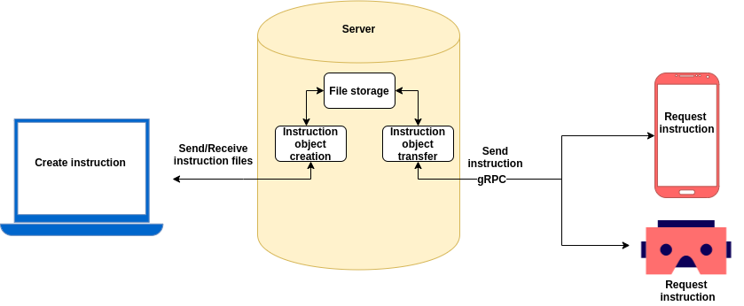

# Innopolis Spring 2020 Software Project

## Virtual assistant
Purpose - providing interactive instructions on a complex technological
process and for working with high-tech and expensive equipment. Instructions
are provided in the form of text, images, and animated holograms.

## Structure
- Web editor
- Server
- AR/MR devices

## Technology stack
- Android Studio (3.53! Very important to have this version)
- ARCore
- Sceneform
- WebGL
- GLTF
- gRPC

## Hardware
In order to run applications you should have Android SDK V27, at least. 
Check if your device is supported [here](https://developers.google.com/ar/discover/supported-devices).

If you don't have it, you can setup the Android Virtual Device. To do that, please, follow [this](https://developers.google.com/ar/develop/java/quickstart) guide.

## Branches
- **dev** - contains Virtual Assistant app and Python Server for it
- **android-research** - contains sample Android ARCore apps and Java server 

